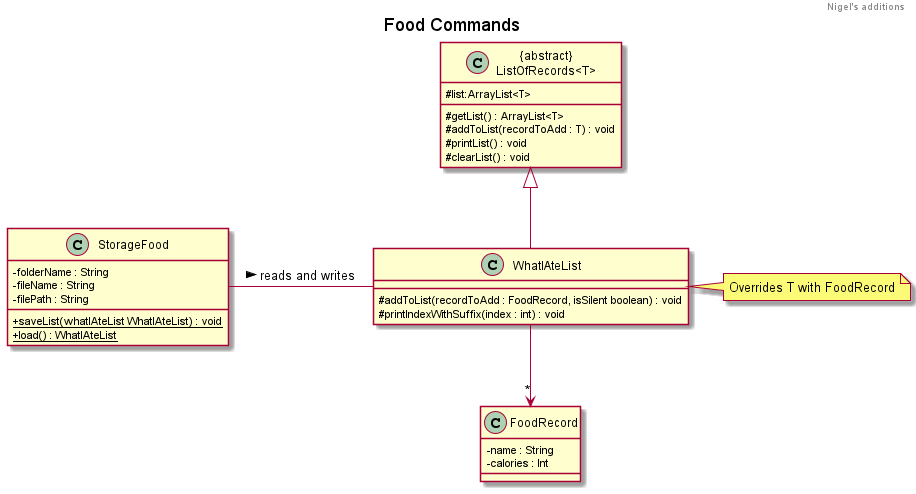
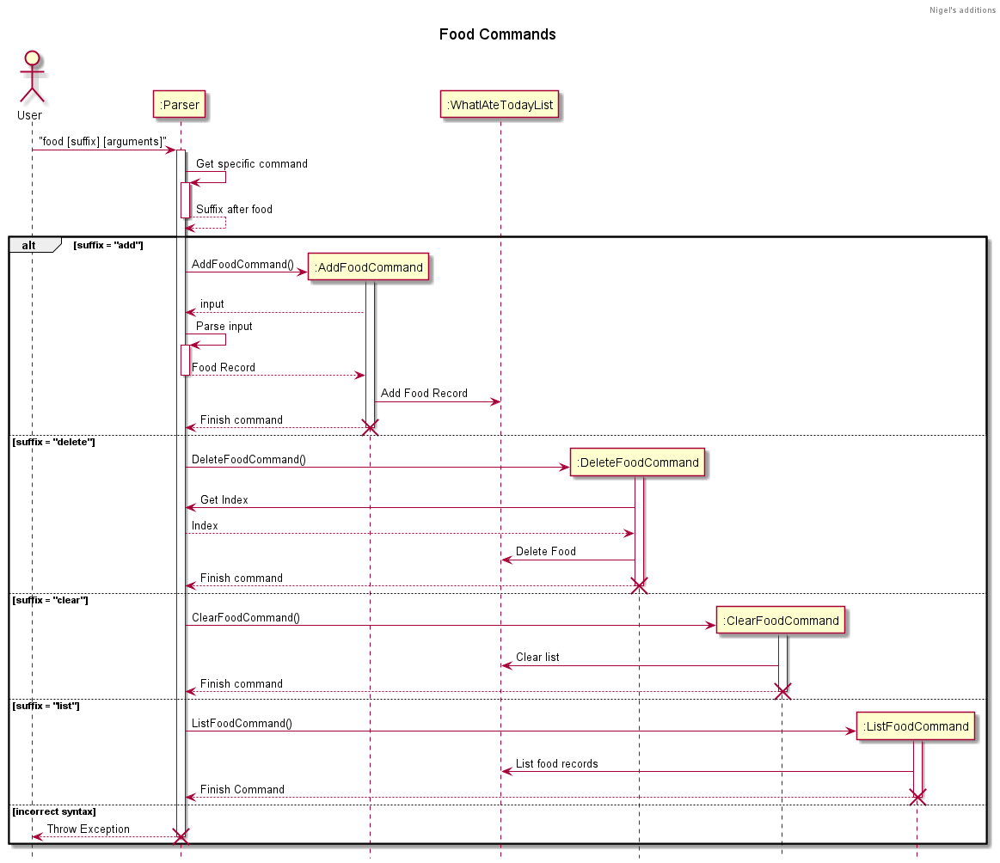
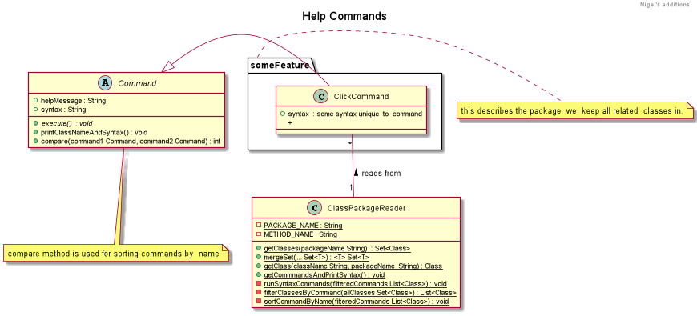
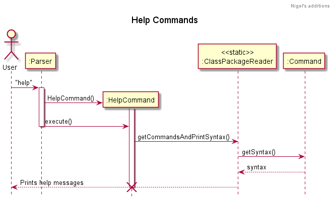

# Click - Developer Guide

## Table of Contents

## 1. Introduction

## 2. Setting Up

## 3. Design

## 4. Implementation

{Describe the design and implementation of the product. Use UML diagrams and short code snippets where applicable.}

### 4.1. Module-related Features

#### 4.1.1 Adding a Module

This feature allows user to add a new Module.

If the creation is successful, a confirmation message on the newly created Module will be displayed to the user.

**Implementation**

The command for listing all modules is implemented by the `AddModuleCommand` class that extends `Command`.

When the user types `module add c/CS2113T n/Software Engineering e/A`, the following sequence of steps will then occur:

1. User executes `module add c/CS2113T n/Software Engineering e/A`\
   i. `Click` receives user's input.\
   ii. `Parser` calls `parser.parseCommand(userInput)` to parse user's input into a `Command`.
2. Creating `AddModuleCommand` object.
3. Executing command.\
   i. `AddModuleCommand` find `indexOfCode`, `indexOfName`, and `indexOfExpectedGrade` in user's input.\
   ii. `AddModuleCommand` calls `getModule()` to create a new `module` based on user's input.\
   iii. `AddModuleCommand` calls `storage.StorageModule.readDataFromFile()` to read Module-related data `moduleList` from the storage file.\
   iv. `AddModuleCommand` calls `moduleList.addModule(module)` to add a new `module` to the list.\
   v. `AddModuleCommand` prompts the successful message to the user.
   vi. `AddModuleCommand` calls `storage.storageModule.saveDataToFile(moduleList)` to save the new data to the storage file.

#### 4.1.2 Removing a Module

This feature allows user to remove a Module created in the past.

If the deletion is successful, a confirmation message on the Module deletion will be displayed to the user.

**Implementation**

The command for listing all modules is implemented by the `DeleteModuleCommand` class that extends `Command`.

When the user types `module delete 2`, the following sequence of steps will then occur:

1. User executes `module delete 2`\
   i. `Click` receives user's input.\
   ii. `Parser` calls `parser.parseCommand(userInput)` to parse user's input into a `Command`.
2. Creating `DeleteModuleCommand` object.
3. Executing command.\
   i. `DeleteModuleCommand` calls `storage.StorageModule.readDataFromFile()` to read Module-related data from the storage file.\
   ii. `DeleteModuleCommand` finds the `moduleIndex` based on user's input.\
   iii. `DeleteModuleCommand` checks if `moduleIndex` is valid or not. If not, throw an `IllegalModuleIndexException`.\
   iv. `DeleteModuleCommand` calls `moduleList.addModule(module)` to add a new `module` to the list.\
   v. `DeleteModuleCommand` prompts the successful message to the user.\
   vi. `DeleteModuleCommand` calls `moduleList.removeModuleByIndex(moduleIndex)` to delete the specified module.\
   vii. `DeleteModuleCommand` calls `storage.storageModule.saveDataToFile(moduleList)` to save the new data to the storage file.

#### 4.1.3 Listing All Modules

This feature allows user to view all Modules.

**Implementation**

The command for listing all modules is implemented by the `ListModuleCommand` class that extends `Command`.

When the user types `module list`, the following sequence of steps will then occur:

1. User executes `module list`\
   i. `Click` receives user's input.\
   ii. `Parser` calls `parser.parseCommand(userInput)` to parse user's input into a `Command`.
2. Creating `ListModuleCommand` object.
3. Executing command.\
   i. `ListModuleCommand` calls `storage.StorageModule.readDataFromFile()` to read Module-related data from the storage file.\
   ii. `ListModuleCommand` check if there is any Modules in the list. If not, prints the message of having no Modules then return.\
   iii. `ListModuleCommand` prompts the message to list the Modules to the user and prints out the Modules line by line.

The sequence diagram below summarizes how listing modules work:

### 4.2 Calendar display feature

**Implementation**

The command for displaying the calendar for a specific month is implemented by the `DisplayCommand` class that extends `Command`.

Given below is an example usage scenario and how the display calendar mechanism behaves at each step.

*Step 1:* The user enters the command `calendar 10-2021`. This command is then sent for parsing in the `Click` class to `parseCommand` method in the `Parser` class. The `parseCommand` method first splits the entire command into an array `todoArguments` containing `calendar` and `10-2021`.

*Step 2:* The string `calendar` from the first index of todoArguments is checked against switch cases and is found to match `COMMAND_CALENDAR` which is the constant string "calendar". Upon finding this match, the string from the second index `todoArguments`is further split based on the delimiter of a single white space. This is then checked against possible suffixes for `calendar` that indicate a particular command and the `Command` object `DisplayCommand` is returned to the `Click` class.

*Step 3:* `Click` class then calls the method `execute` of `DisplayCommand` class. `DisplayCommand` extends `Command` class and has three steps in its `execute` method.
- The `parseCalendarCommand` is first called, and it returns the year and month values after splitting `10-2021` into `10` and `2021`. This is put together into an YearMonth object `inputYearMonth`.
  >  **NOTE:** The input is validated first and if the input date given is invalid, i.e., the month not between 1-12, then the calendar for the current month is displayed.
- The `inputYearMonth` is passed into `Ui` class method `printCalenderTitle` and this prints out the title of that month with the month name and the year. In this example, it will display,
  
- Then, the method `arrangeTaskList` in `Schedule` class is called, and it takes in `storage.tasksList` (the TaskList object with all the currently stored tasks drawn from storage), `calendarTasks` (an ArrayList<ArrayList<String>> object initialized with empty ArrayLists of type String), `month` (the month input by the user, which in this example is the integer `10`) and year `month` (the year input by the user, which in this example is the integer `2021`), and adds the tasks to the days in the empty String ArrayLists initialized before in `calendarTasks`.
  The method `arrangeLectureList` is also called and the process is same, except with `storage.lectureList` and `calendarLecture` replacing the first two input parameters of `arrangeTaskList`.
- Then, the method `displayCalendar` in `Schedule` class is called, and it takes in `inputYearMonth` (the YearMonth object created from the month and year parsed from the user input), and `calendarTasks` (that was filled with the tasks for each day in the previous step). The method `displayCalendar` performs the necessary logic to print out a calendar with tasks as below.
  >  **NOTE:** Two tasks and two lectures are displayed for each day based on the order in which the user added them, and if there are more, they will show as and when the user deletes the tasks/lectures that are currently displayed.

The below sequence diagram shows the execution process of the calendar display feature.

### Design Considerations
The following design considerations were kept in mind while implementing the calendar display feature,
- Aspect: Calendar visual display
    - Alternative 1: Display two tasks and two lectures at any time.
        - Pros : The calendar displayed would appear even and solution is easier to implement.
        - Cons: All the tasks and lectures not displayed.
    - Alternative 2: Set the size of the calendar to accommodate the largest number of tasks and lectures for a particular day. For example, if a day has 8 tasks and lectures and that is the highest amongst all the days, then the calendar would change to show all 8 for this day and the remaining days would have filled display up till how many tasks and lectures they have and the remaining spots empty.
        - Pros : The calendar displayed would show all the tasks and lectures.
        - Cons: Difficult to implement.

### 4.3 Journaling Feature

## 1. Add notebook feature

The command for adding notebook is implemented by the `AddNoteCommand` class that extends `Command`.
On adding notebook successfully, the message "Great you have added the note: NOTEBOOK_NAME" will be displayed.

## 1. Add entry feature

The command for adding entry is implemented by the `AddEntryCommand` class that extends `Command`.

On adding entry successfully, the message "Great you have added the entry: ENTRY_NAME" will be displayed.

## 1. List notebooks and entries

The command for adding notebook is implemented by the `ListJournalCommand` class that extends `Command`.

A list of notebooks along with their entries will be displayed.

## 2. Testing

1. You can enter the command journal notebook n/ <NOTEBOOK_NAME> to add a notebook.
   You are free to enter a notebook name of your choice and observe the output of this command.

   `Test case: journal entry n/ TRIAL e/ TEST
   Expected: Great you have added the entry: TEST`

2.You can enter the command journal entry n/ <ENTRY_NAME> to add an entry to a specific notebook.
You are free to enter an entry name of your choice and observe the output of this command.

    Test case: journal entry n/ TRIAL e/ TEST
    Expected: Great you have added the entry: TEST

3.You can enter the command journal list to view list of notebooks and their entries

    Test case: journal list
    Expected: The notebook TRIAL contains:
              TEST

###4.4 Food related features
This segment focuses on describing the implementation of food-related features,
the functionality of the commands as well as the design considerations taken.
#### Architecture
#####Class Diagram of Food
Food-related commands operate on a list of food records, and a food storage object. The following diagram  illustrates
how the storage in a text file, and the current food list interact with each other.
Food storage object contains static methods to read and write data from said list.
The saving of data from the list to the storage file is elaborated further in the diagram below.
Further discussion on the design considerations of writing an abstract class are discussed in 
design considerations.

##### Sequence diagram when food is parsed
The following diagram displays the interactions between the classes when the user enters a command starting with
"food". You should take note of the interactions between the constructed command classes, and the current list it's
iterating over - `WhatIAteTodayList`, especially the updates shown after the  end of every  command. An update is 
defined as a manual overwrite over the text file saved in the user's hard disk. By convention, this text file is saved
in the directory `fooddata` , with the text file named aptly as `food.txt`. Current improvements in this functionality
would be to integrate the dates in `Calendar` with  the `food.txt` file, enabling the user to search what they ate on a
given day.

#### Components
> **Note**: the methods invoked in the following commands are visually depicted in the sequence  diagram,
> and thus only the general functionality  is discussed, as  well as the design considerations taken.
##### Adding Food Record
This feature allows user to add a new Food Record.
Tags `n/` `c/` stand for name and calorie count respectively.

**Code example**

`food add n/ Samurai Burger c/ 433`

##### Removing Food Record

This feature allows user to remove a Food Record created in the past.

**Code example**

`food delete [INDEX]`
##### Listing All Food Records

This feature allows user to view all Food Records.

This would be particularly useful for deleting items.

**Code example**

`food list`

##### Clearing food list

This feature allows users to clear their Food List.

**Code example**

`food clear`

##### Saving food list on successful command

The storage on hard-disk would be automatically
updated on every successful command entered by the user.

The interworking of this is described in detail in architecture.

#####Food Design considerations
1. Why is there a need for calorie count?
   > Health tracking is important for students, especially during the pandemic
   where we stress eat during online lessons.
1. Why is there a need to remove a record? We can't un-eat stuff
   > Yes, however due to the limitations of the CLI interface there may be wrongly spelled
   entries that the user wouldn't want reflected in the list.
   Additionally, each food calorie count
   would be summed up to show the user the total calories consumed per day. If the calories
   entered are missing or have an additional 0 the sum would be overinflated 
1. Why implement  `ListOfRecords`?  It seems like a duplicate of `ArrayList<T>`
    > The abstract class `ListOfRecords` may seem uneventful to you on the surface, however
    much consideration was taken in account in the making. For instance, in our current iteration
    we are introducing a way to integrate current food names and calorie count from existing
    food courts - e.g. TechnoEdge. Another class could inherit from `ListOfRecords` in order to parse in
    the correct data, hence the generic `T` type used in the list.

###4.5 Zoom related features

###4.6  Help command
This segment focuses on describing the not so-simple implementations behind what would otherwise
be considered a simple feature. An interesting point for you to note before exploring this portion 
would be the runtime-analysis of classes  done by the compiler, which reads the classes from the
source code and extracts the syntax. This is perhaps more functional than printing out a string
concatenating all command syntax.

####Architecture  of Help Command
The following diagram illustrates the  interactions between the functional class `ClassPackageReader` and
a particular command `ClickCommand`.

A class package reader  is implemented in order to:
1.  Read classes from a specified package
1.  Get names of all classes declared
1.  Filter out the classes that are not commands by inheritance
1.  Collect the commands in a set
1.  Iterate through all other listed packages and merge the sets
1.  Sort the filtered commands by alphabetical order for readability
1.  Read the specific syntax  of a command, and print it to the user

The abstract class `Command` has the following methods which 
implement steps 3 & 4:
1. `public int compare(Command command1, Command command2){...}`
   >This comparator is used in the
`ClassPackageReader` to sort out the Commands by name, and is further elaborated in Logic.
1. `public void printClassNameAndSyntax()` 
    > This function splits the name of the class by upper and lower case, and also to remove the
    "command" word at the end of the class. 

Next, we decided to run the `ClassPackageReader` through a package rather than iterate through all classes.
The former is better than the latter considering our implementation of the commands. For instance, all module-
related commands are grouped together in the `module` package, food-related commands in `food` etc. Thus, by
accessing the packages and filtering out the commands, the `ClassPackageReader` presents the name of the command
and the syntax in a readable format to the user. Do note that the packages have to be manually input by the developers.
However, the core functionality of Click is already partitioned nicely into the packages and hence we do not expect
many updates over the lifeline of this project.

####Logic of Help Command
After describing the architecture of the help command, this portion will then describe the sequence of activation by
the user when parsing a `help` command. Take the following sequence diagram for reference.

The sequence diagram provides a high-level view on how the entities interact. You should notice the interaction between
`ClassPackageReader` and the `Command` entities, where the former gets the syntax of the latter by having a class as
input. This translates into a scalable option on addition of commands, where a syntax attribute is required to be present
in an empty constructor rather than concatenating additional syntax onto a constant String variable.

We reviewed the high-level functionality of `ClassPackageReader`, but it is also important for developers to take note of how
this class works on a lower-level. The function described here is `getCommandsAndPrintSyntax()`
1. Get classes from given packages, have each package converted into a Set of Classes.
1. Merge all the Sets together
1. Filter out the classes that are not Commands by inheritance, and add them into a List
1. Sort classes in List by name
1. For each command in List, (non-command classes are excluded in previous step)
    1. Get the declared method of abstract class Command `printClassNameAndSyntax()`
    1. Create default constructor of command and invoke the method given in (i)
    
You should take note that by step 5, this help functionality relies heavily on a _default constructor_. 
>Thus, 
when writing new `Commands`, a default constructor that contains no parameters has to overwrite the `syntax` element
in abstract class `Command`. This ensures that the  method creation and invocation of method in step 5 would be ready
to execute.
#####Design considerations of Help Command
######Aspect:  How to implement Help feature    
| \ | Alternative 1 (current choice): Reads the name and syntax from the Classes | Alternative 2 (previous choice): Prints all available commands from a String, hard-coding every syntax and printing |
|---|---|---|
| Pros | 1. Dynamic, works well and sorts the names by order as long as the constructor is included for a command 2. Very readable and testable due to sorted names 3. OOP implementation with overloaded methods and branching on inheritance 4. The user gets to easily view *ALL*  possible commands with a single word | 1. Easy to implement, just adding all available commands into a String and print it out 2. Relatively fewer lines of code (LoC) 3. User gets specific syntax with command entered |
| Cons | 1. Possible depreciated methods (`Class.getMethod`, `Class.getDeclaredConstructor`) which may be outdated, however,   are still functional 2. Many more lines of code  (LoC) for implementation  3. The user  is bombarded with *ALL* possible commands with a single word | 1. Hard-coding and sorting help commands manually is a chore 2. User still has to remember the command in order to access the syntax |

While we submitted Alternative 2 in version 1 due to a lack of time and easier implementation. with more time given in Version 2.0 - we
decided  to switch over to Alternative 1 for the user to easily view all the syntax at a glance.
## 5. Testing

## 6. Dev Ops

## Appendices

### Appendix A: Product scope
### Appendix B: Target user profile

{Describe the target user profile}

### Appendix C: Value proposition

{Describe the value proposition: what problem does it solve?}

### Appendix D: User Stories

|Version| As a ... | I want to ... | So that I can ...|
|--------|----------|---------------|------------------|
|v1.0|new user|see usage instructions|refer to them when I forget how to use the application|
|v2.0|user|find a to-do item by name|locate a to-do without having to go through the entire list|

### Appendix E: Non-Functional Requirements

{Give non-functional requirements}

### Appendix F: Glossary

* *glossary item* - Definition

