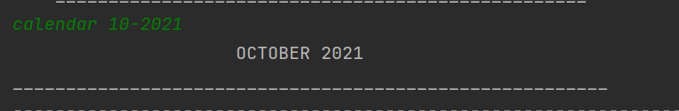
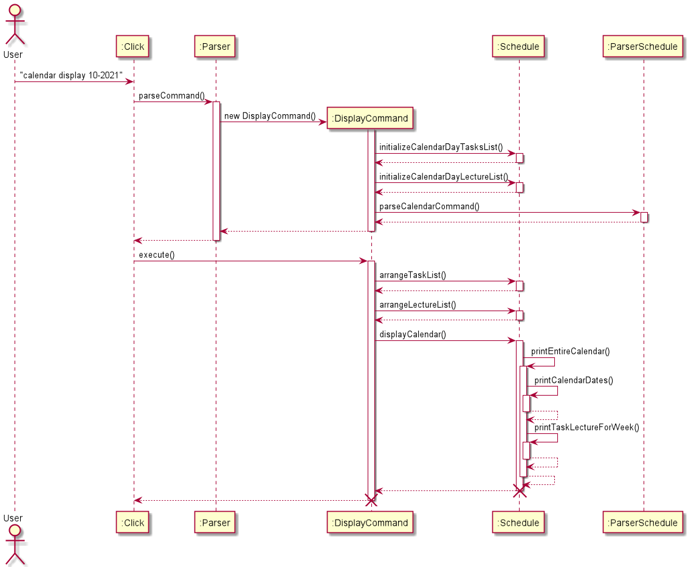

# Click - Developer Guide

## Table of Contents

## 1. Introduction

## 2. Setting Up

## 3. Design

## 4. Implementation

{Describe the design and implementation of the product. Use UML diagrams and short code snippets where applicable.}

### 4.1. Module-related Features

#### 4.1.1 Adding a Module

This feature allows user to add a new Module.

If the creation is successful, a confirmation message on the newly created Module will be displayed to the user.

**Implementation**

The command for listing all modules is implemented by the `AddModuleCommand` class that extends `Command`.

When the user types `module add c/CS2113T n/Software Engineering e/A`, the following sequence of steps will then occur:

1. User executes `module add c/CS2113T n/Software Engineering e/A`\
   i. `Click` receives user's input.\
   ii. `Parser` calls `parser.parseCommand(userInput)` to parse user's input into a `Command`.
2. Creating `AddModuleCommand` object.
3. Executing command.\
   i. `AddModuleCommand` find `indexOfCode`, `indexOfName`, and `indexOfExpectedGrade` in user's input.\
   ii. `AddModuleCommand` calls `getModule()` to create a new `module` based on user's input.\
   iii. `AddModuleCommand` calls `storage.StorageModule.readDataFromFile()` to read Module-related data `moduleList` from the storage file.\
   iv. `AddModuleCommand` calls `moduleList.addModule(module)` to add a new `module` to the list.\
   v. `AddModuleCommand` prompts the successful message to the user.
   vi. `AddModuleCommand` calls `storage.storageModule.saveDataToFile(moduleList)` to save the new data to the storage file.

#### 4.1.2 Removing a Module

This feature allows user to remove a Module created in the past.

If the deletion is successful, a confirmation message on the Module deletion will be displayed to the user.

**Implementation**

The command for listing all modules is implemented by the `DeleteModuleCommand` class that extends `Command`.

When the user types `module delete 2`, the following sequence of steps will then occur:

1. User executes `module delete 2`\
   i. `Click` receives user's input.\
   ii. `Parser` calls `parser.parseCommand(userInput)` to parse user's input into a `Command`.
2. Creating `DeleteModuleCommand` object.
3. Executing command.\
   i. `DeleteModuleCommand` calls `storage.StorageModule.readDataFromFile()` to read Module-related data from the storage file.\
   ii. `DeleteModuleCommand` finds the `moduleIndex` based on user's input.\
   iii. `DeleteModuleCommand` checks if `moduleIndex` is valid or not. If not, throw an `IllegalModuleIndexException`.\
   iv. `DeleteModuleCommand` calls `moduleList.addModule(module)` to add a new `module` to the list.\
   v. `DeleteModuleCommand` prompts the successful message to the user.\
   vi. `DeleteModuleCommand` calls `moduleList.removeModuleByIndex(moduleIndex)` to delete the specified module.\
   vii. `DeleteModuleCommand` calls `storage.storageModule.saveDataToFile(moduleList)` to save the new data to the storage file.

#### 4.1.3 Listing All Modules

This feature allows user to view all Modules.

**Implementation**

The command for listing all modules is implemented by the `ListModuleCommand` class that extends `Command`.

When the user types `module list`, the following sequence of steps will then occur:

1. User executes `module list`\
   i. `Click` receives user's input.\
   ii. `Parser` calls `parser.parseCommand(userInput)` to parse user's input into a `Command`.
2. Creating `ListModuleCommand` object.
3. Executing command.\
   i. `ListModuleCommand` calls `storage.StorageModule.readDataFromFile()` to read Module-related data from the storage file.\
   ii. `ListModuleCommand` check if there is any Modules in the list. If not, prints the message of having no Modules then return.\
   iii. `ListModuleCommand` prompts the message to list the Modules to the user and prints out the Modules line by line.

The sequence diagram below summarizes how listing modules work:

### Calendar display feature

**Implementation**

The command for displaying the calendar for a specific month is implemented by the `DisplayCommand` class that extends `Command`.

Given below is an example usage scenario and how the display calendar mechanism behaves at each step.

*Step 1:* The user enters the command `calendar 10-2021`. This command is then sent for parsing in the `Click` class to `parseCommand` method in the `Parser` class. The `parseCommand` method first splits the entire command into an array `todoArguments` containing `calendar` and `10-2021`.

*Step 2:* The string `calendar` from the first index of todoArguments is checked against switch cases and is found to match `COMMAND_CALENDAR` which is the constant string "calendar". Upon finding this match, the string from the second index `todoArguments`is further split based on the delimiter of a single white space. This is then checked against possible suffixes for `calendar` that indicate a particular command and the `Command` object `DisplayCommand` is returned to the `Click` class.

*Step 3:* `Click` class then calls the method `execute` of `DisplayCommand` class. `DisplayCommand` extends `Command` class and has three steps in its `execute` method.
- The `parseCalendarCommand` is first called, and it returns the year and month values after splitting `10-2021` into `10` and `2021`. This is put together into an YearMonth object `inputYearMonth`.
  >  **NOTE:** The input is validated first and if the input date given is invalid, i.e., the month not between 1-12, then the calendar for the current month is displayed.
- The `inputYearMonth` is passed into `Ui` class method `printCalenderTitle` and this prints out the title of that month with the month name and the year. In this example, it will display,
  
- Then, the method `arrangeTaskList` in `Schedule` class is called, and it takes in `storage.tasksList` (the TaskList object with all the currently stored tasks drawn from storage), `calendarTasks` (an ArrayList<ArrayList<String>> object initialized with empty ArrayLists of type String), `month` (the month input by the user, which in this example is the integer `10`) and year `month` (the year input by the user, which in this example is the integer `2021`), and adds the tasks to the days in the empty String ArrayLists initialized before in `calendarTasks`.
  The method `arrangeLectureList` is also called and the process is same, except with `storage.lectureList` and `calendarLecture` replacing the first two input parameters of `arrangeTaskList`.
- Then, the method `displayCalendar` in `Schedule` class is called, and it takes in `inputYearMonth` (the YearMonth object created from the month and year parsed from the user input), and `calendarTasks` (that was filled with the tasks for each day in the previous step). The method `displayCalendar` performs the necessary logic to print out a calendar with tasks as below.
  >  **NOTE:** Two tasks and two lectures are displayed for each day based on the order in which the user added them, and if there are more, they will show as and when the user deletes the tasks/lectures that are currently displayed.

The below sequence diagram shows the execution process of the calendar display feature.

### Design Considerations
The following design considerations were kept in mind while implementing the calendar display feature,
- Aspect: Calendar visual display
    - Alternative 1: Display two tasks and two lectures at any time.
        - Pros : The calendar displayed would appear even and solution is easier to implement.
        - Cons: All the tasks and lectures not displayed.
    - Alternative 2: Set the size of the calendar to accommodate the largest number of tasks and lectures for a particular day. For example, if a day has 8 tasks and lectures and that is the highest amongst all the days, then the calendar would change to show all 8 for this day and the remaining days would have filled display up till how many tasks and lectures they have and the remaining spots empty.
        - Pros : The calendar displayed would show all the tasks and lectures.
        - Cons: Difficult to implement.

# Journaling Feature

## 1. Add notebook feature

The command for adding notebook is implemented by the `AddNoteCommand` class that extends `Command`.
On adding notebook successfully, the message "Great you have added the note: NOTEBOOK_NAME" will be displayed.

## 1. Add entry feature

The command for adding entry is implemented by the `AddEntryCommand` class that extends `Command`.

On adding entry successfully, the message "Great you have added the entry: ENTRY_NAME" will be displayed.

## 1. List notebooks and entries

The command for adding notebook is implemented by the `ListJournalCommand` class that extends `Command`.

A list of notebooks along with their entries will be displayed.

## 2. Testing

1. You can enter the command journal notebook n/ <NOTEBOOK_NAME> to add a notebook.
   You are free to enter a notebook name of your choice and observe the output of this command.

   `Test case: journal entry n/ TRIAL e/ TEST
   Expected: Great you have added the entry: TEST`

2.You can enter the command journal entry n/ <ENTRY_NAME> to add an entry to a specific notebook.
You are free to enter an entry name of your choice and observe the output of this command.

    Test case: journal entry n/ TRIAL e/ TEST
    Expected: Great you have added the entry: TEST

3.You can enter the command journal list to view list of notebooks and their entries

    Test case: journal list
    Expected: The notebook TRIAL contains:
              TEST

## 5. Testing

## 6. Dev Ops

## Appendices

### Appendix A: Product scope
### Appendix B: Target user profile

{Describe the target user profile}

### Appendix C: Value proposition

{Describe the value proposition: what problem does it solve?}

### Appendix D: User Stories

|Version| As a ... | I want to ... | So that I can ...|
|--------|----------|---------------|------------------|
|v1.0|new user|see usage instructions|refer to them when I forget how to use the application|
|v2.0|user|find a to-do item by name|locate a to-do without having to go through the entire list|

### Appendix E: Non-Functional Requirements

{Give non-functional requirements}

### Appendix F: Glossary

* *glossary item* - Definition

