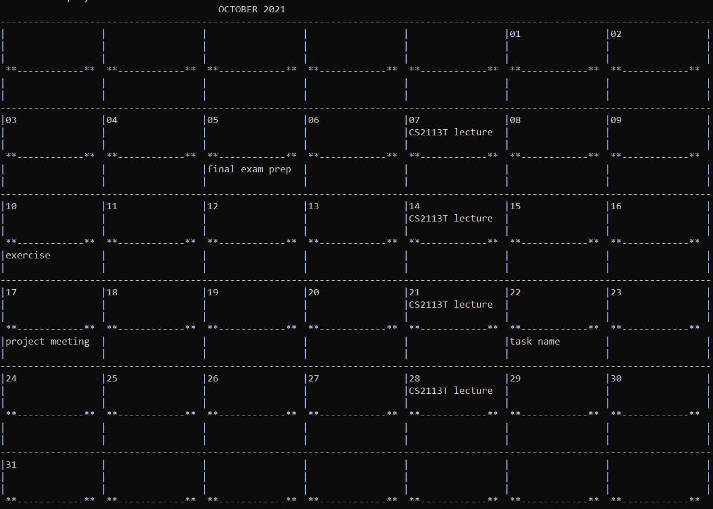

# Click - User Guide

## Table of Contents

1. [Introduction](#1-introduction)
2. [Quick Start](#2-quick-start)
3. [Features](#3-features)\
3.0 [Help feature](#301-getting-help)\
3.1 [Managing your modules](#31-managing-your-modules)\
3.2 [Managing your zoom-links](#32-managing-your-zoom-links)\
3.3 [Managing your calendar](#33-managing-your-calendar)\
3.4 [Managing your journal](#34-managing-your-journal)\
3.5 [Managing your food consumption](#35-managing-your-food-consumption)
4. [Command Summary](#4-command-summary)
5. [Frequently Asked Questions](#5-frequently-asked-questions)
6. [Bug reports](#6-bug-reports)

## 1. Introduction

Welcome to your all-in-one desktop app for managing modules, tracking your food consumption, time scheduling, journaling, and CAP planning!
We know that you are a CS student here at NUS 👨‍🎓 and may prefer typing ⌨ to swiping (Hello Vim! 😉)
, so we think that our command line interface for cramming & knowledge (Click) is a great fit for you! 

This user guide provides a guide to *traversing* our *array* of features for you to *sort* your life into place.
Every feature of Click is carefully documented, and the syntax requirements are provided for  you to explore.

Jump in to the section [2. Quick Start](#2-quick-start) to get started!

## 2. Quick Start

1. Ensure you have Java `11` or above installed in your Computer.
2. Download the latest `click.jar` from [here](https://github.com/AY2122S1-CS2113T-T09-4/tp/releases/tag/v1.0).
3. Copy the file to the folder you want to use as the _home folder_ for Click.
4. In the home folder for Click, launch the `jar` file using the `java -jar click.jar` command on Command Prompt (for Windows) or Terminal (for Unix-based OS, such as macOS and Linux) to start the app. If the setup is correct, you should see the following:

```
	__________________________________________________
	 _____ _  _     _
	/  __ \ |(_)   | |
	| /  \/ |_  ___| | __
	| \__/\ | | (__|   <
	\_____/_|_|\___|_|\_\

	Hello! I'm Duke
	What can I do for you?
	__________________________________________________
```

5. Type the valid command into the terminal (or Command Prompt) and press <kbd>return</kbd> (or <kbd>Enter</kbd>) to run the command.

## 3. Features 

**Before you begin, please note the command format:**

- Words in `UPPER_CASE` are the parameters to be supplied by you.
  
- The `INDEX` used in various commands must be a number specifying the order of an item in the list of items.
The smallest index would naturally be 1. (1-based)
  
- The `{}` wrapping indicates an optional parameter.

- Parameters cannot be reordered.
  Example: If the command specifies `module add c/MODULE_CODE n/MODULE_NAME`, keying in `module add n/MODULE_NAME c/MODULE_CODE` will result in an invalid command.

### 3.0 Getting Help
Click helps you by showing all available commands and syntax

Format: `help`

You can refer  to [Command Summary](#4-command-summary) for a TLDR version.

### 3.1 Managing your modules

#### 3.1.1 Adding a Module: `module add`

Adds a new module to the list of modules so that you can keep track of the modules you are taking or planning to take.

Click supports 4 ways of adding Modules:
- Adding with module code, module name, modular credits and expected grade.
- Adding with module code, module name, and modular credits.
- Adding with module code and module name.
- Adding with module code only.

**Adding with module code, module name, modular credits, and expected grade**

Format: `module add c/MODULE_CODE n/MODULE_NAME mc/MODULAR_CREDITS e/EXPECTED_GRADE`

Example: `module add c/CS2113T n/Software Engineering mc/4 e/A`

Expected outcome:

```
	__________________________________________________
	I have added this module:
	CS2113T | Software Engineering | MC: 4 | Expected grade: A
	__________________________________________________
```

**Adding with module code, module name, and modular credits**

Format: `module add c/MODULE_CODE n/MODULE_NAME mc/MODULAR_CREDITS`

Example: `module add c/CS1231 n/Discrete Structure mc/4`

Expected outcome:

```
	__________________________________________________
	I have added this module:
	CS1231 | Discrete Structure | MC: 4 | Expected grade: NA
	__________________________________________________
```

**Adding with module code and module name**

Format: `module add c/MODULE_CODE n/MODULE_NAME`

Example: `module add c/CS1010 n/Programming Methodology`

Expected outcome:

```
	__________________________________________________
	I have added this module:
	CS1010 | Programming Methodology | MC: 4 | Expected grade: NA
	__________________________________________________
```

**Adding with module code only**

Format: `module add c/MODULE_CODE`

Example: `module add c/CG2028`

Expected outcome:

```
	__________________________________________________
	I have added this module:
	CG2028 | None | MC: 4 | Expected grade: NA
	__________________________________________________
```

#### 3.1.2 Listing Modules: `module list`

Lists all modules in Click with numbering according to the order they are added (1-based index) so that you can have an overview of your modules.

Format: `module list`

Expected outcome:

```
	__________________________________________________
	Here are the modules in your list:
	1. CS2113T | Software Engineering | MC: 4 | Expected grade: A
	2. CS1231 | Discrete Structure | MC: 4 | Expected grade: NA
	3. CS1010 | Programming Methodology | MC: 4 | Expected grade: NA
	4. CG2028 | None | MC: 4 | Expected grade: NA
	__________________________________________________
```

#### 3.1.3 Deleting a Module: `module delete`

Deletes the specified module from the list of modules so that you can get rid of the modules you do not want to take anymore.

Format: `module delete INDEX`

Example: `module delete 3`

Expected outcome:

```
	__________________________________________________
	I have deleted this module:
	CS1010 | Programming Methodology | MC: 4 | Expected grade: NA
	__________________________________________________
```

#### 3.1.4 Editing CAP Information

Edits information of your current Cumulative Average Point (CAP) and the number of modular credits you have taken so that Click can calculate your expected CAP.

Format: `cap edit`

Example:

```
	__________________________________________________
	What is your current cumulative average point (CAP)?
4.5
	How many modular credits contributing to CAP you have taken?
40
	Thank you for your information. You can view your expected CAP by keying in cap expected
	__________________________________________________
```

#### 3.1.5 Getting the Expected CAP

Gets the expected CAP based on the provided information and the modules you are taking.

Format: `cap expected`

Expected outcome:

```
	__________________________________________________
	Your current CAP is 4.5, and the total of MCs contributing to your CAP is 40
	Your expected CAP based on the modules you are taking is: 4.55
	__________________________________________________
```

### 3.2 Managing your Zoom links

#### 3.2.1 Adding a new zoom link: `zoom add`
Adds a zoom link.

Note: You cannot add a lecture to a module unless the module has been added previously.

Format: `zoom add [MODULE_CODE] [ZOOM_LINK]`

Example:
```
zoom add CS2113T https://nus-sg.com
```

Expected outcome:
```
Zoom link added successfully
```

#### 3.2.2 Updating a zoom link: `zoom add`
Updates a zoom link.

Note: You can edit the zoom link for a module only if it already exists.

Format: `zoom add [MODULE_CODE] [ZOOM_LINK]`

Example:
```
zoom add CS2113T https://nus-sg.com/updatedLink
```

Expected outcome:
```
Zoom link updated successfully!
```

#### 3.2.3 List all zoom links: `zoom list`
Lists all zoom links.

Format: `zoom list`

Example:
```
zoom list
```

Expected outcome:
```
Module: CS2113T
Zoom: https://nus-sg.com/updatedLink
```

#### 3.2.4 Opens the zoom link on browser: `zoom open`
Opens zoom link on browser.

Format: `zoom open [MODULE_CODE]`

Example:
```
zoom open CS2113T
```

### 3.3 Managing your calendar

#### 3.3.1 Adding a lecture: `calendar lecture`
Adds a lecture item.

Note: You cannot add a lecture to a module unless the module has been added previously.

Format: `calendar lecture m/ MODULE_CODE s/ DD-MM-YYYY(START_DATE) e/ DD-MM-YYYY(END_DATE)`

Example:
```
calendar lecture m/ CS2113T s/ 7-10-2021 e/ 31-10-2021
```

Expected outcome:
```
Added lecture!
```

#### 3.3.2 Adding a todo task: `calendar todo`
Adds a task item.

Format: `calendar todo n/ TASK_NAME d/ DD-MM-YYYY`

Example:
```
calendar todo n/ GER1000 Assignment d/ 14-10-2021
```

Expected outcome:
```
Task has been added successfully!
```

#### 3.3.3 Listing tasks: `calendar list task`
Lists all the current task items.

Format: `calendar list task`

Example:
```
calendar list task 
```

Expected outcome:
```
Here's your task list:
1. GER1000 Assignment (on: 14-10-2021)
2. GEQ1000 Assignment (on: 03-10-2021)
```
#### 3.3.4 Deleting a task: `calendar delete task`
Deletes a task item based on the index.

Format: `calendar delete task TASK_INDEX`

Example:
```
calendar delete task 1
```

Expected outcome:
```
Task has been deleted!
```
#### 3.3.5 Editing a task: `calendar edit`
Edits a task item based on the index.

Format: `calendar edit TASK_INDEX`

Example:
```
calendar edit 1
```

Expected outcome:
```
Enter the entire todo command with the desired description and date that you want to replace in place of the current task at index 1
>> calendar todo n/ changed task name d/ 22-12-2021
Edited Task!
```
#### 3.3.6 Displaying calendar: `calendar display`
Displays a calendar based on the month.

Note: If month entered by user is incorrect, then CLICK will display the calendar of the current month.

Format: `calendar display MM-YYY`

Example:
```
calendar display 10-2021
```

Expected outcome:


#### 3.3.7 Deleting a lecture: `calendar delete lec`
Deletes a lecture item based on the index.

Format: `calendar delete lec LECTURE_INDEX`

Example:
```
calendar delete lec 1
```

Expected outcome:
```
Lecture has been deleted!
```

#### 3.3.3 Listing lectures: `calendar list lec`
Lists all the current task items.

Format: `calendar list lec`

Example:
```
calendar list lec 
```

Expected outcome:
```
Here is your list of lectures:
1. ger1000 (from: 02-10-2021) (to: 31-10-2021) 
2. cs2101 (from: 10-10-2021) (to: 30-11-2021) 
```

### 3.4 Managing your journal
#### 3.4.1 Adding a notebook: `journal notebook`
Adds a notebook with the desired name.

Format: `journal notebook n/ NOTEBOOK_NAME`

Example: `journal notebook n/ Today`

Expected outcome:

```
Great you have added the notebook: Today
```

#### 3.4.2 Adding an entry: `journal entry`
Adds an entry with the desired name to a specific notebook

Format: `journal entry n/ NOTEBOOK_NAME e/ ENTRY_NAME`

Example: `journal entry n/ Today e/ Random Observation`

Expected outcome:

```
Great you have added the entry: Random Observation
```

#### 3.4.3 Listing notebooks with entries: `journal list`
Lists all notebooks with their entries.

Format: `journal list`

Example: `journal list`

Expected outcome:

```
1. The notebook Today contains:
  1. Random Observation
```

#### 3.4.4 Deleting notebooks `journal delete_notebook`
Deletes specific notebook.

Format: `journal delete_notebook NOTE_INDEX`

Example: `journal delete_notebook 1`

Expected outcome:

```
Great you have deleted the notebook at : 1
```

#### 3.4.5 Deleting entry `journal delete_entry`
Deletes the entry.

Format: `journal delete_entry n/ NOTE_NAME e/ ENTRY_NAME`

Example: `journal delete_entry n/ CS2113 e/ Have to finish HW`

Expected outcome:

```
Great you have deleted the entry
```

#### 3.4.6 Tagging a notebook
Allows you to tag a notebook.

Format: `journal tag n/ NOTE_INDEX t/ TAG_NAME`

Example: `journal tag n/ 1 t/ important`

Expected outcome:

```
Great you have tagged the notebook
```

#### 3.4.7 Find a notebook by tag
Allows you to find a notebook which has the tag.

Format: `journal find TAG_NAME`

Example: `journal find important`

Expected outcome:

```
Notebooks with the tag important are: 
CS2113 HW
```


### 3.5 Managing your food consumption

Sometimes you snack, maybe go for supper breaks now and then.
After all, you need to power the processor we all have - our brain!
Click provides you with the ability to track your food consumption to
match your dieting needs to consume the recommended amount of calories 
you need every day!

#### 3.5.1 Adding a food item: `food add`
Allows you to add a food item and calorie count

Format: `food add n/FOOD_NAME n/KCALORIE d/ {DATE}`

For instance, imagine you've just had a nice meal at McDonald's after
a three-hour-long lecture. You feel guilty about having so much fast food.
However, how do you quantify your guilty-ness? Simply tell Click what you've
eaten and how many calories are included, so you can see how far you should run
to burn them away!

Example: 

```
food add n/ Samurai Burger c/ 433
food add n/ Seaweed Shaker Fries Seasoning c/ 15
food add n/ Large Fries c/  461
food add n/ Caramel Frappé - Medium c/ 624
food add n/ A Thousand Tide Pods c/ 92
```

Expected outcome:

```
    __________________________________________________
	Nice.  I've added Samurai Burger to the list, with 433 calories!
	__________________________________________________
	__________________________________________________
	Nice.  I've added Seaweed Shaker Fries Seasoning to the list, with 15 calories!
	__________________________________________________
	__________________________________________________
	Nice.  I've added Large Fries to the list, with 461 calories!
	__________________________________________________
	__________________________________________________
	Nice.  I've added Caramel Frappé - Medium to the list, with 624 calories!
	__________________________________________________

	__________________________________________________
	Nice.  I've added A Thousand Tide Pods to the list, with 92 calories!
	__________________________________________________
```

Example of adding with a date

`food add n/ something i ate 2 weeks ago but forgot to record c/ 300 d/ 13-10-2021`

Expected outcome:
```
	Nice, I see you consumed something i ate 2 weeks ago but forgot to record on 2021-10-13, and have recorded 
	__________________________________________________
	Nice.  I've added something i ate 2 weeks ago but forgot to record to the list, with 300 calories!
	__________________________________________________
```

#### 3.5.2a Listing food records: `food list`

Format : `food list`

What did you have for lunch on the 27th of October - forgot already? 
Not to worry. Simply tell Click to list the food items you've recorded.
Additionally, the calories consumed are nicely added up for you.

Expected outcome:

```
	__________________________________________________
	1st,You consumed  Samurai Burger , which has a calorie count of : 433 on 2021-10-27!
	2nd,You consumed  Seaweed Shaker Fries Seasoning , which has a calorie count of : 15 on 2021-10-27!
	3rd,You consumed  Large Fries , which has a calorie count of : 461 on 2021-10-27!
	4th,You consumed  Caramel Frappé - Medium , which has a calorie count of : 624 on 2021-10-27!
	5th,You consumed  A Thousand Tide Pods , which has a calorie count of : 92 on 2021-10-27!
	Wow, that's a lot of food! Finished reading the list
	You consumed 1625 calories in total!
	__________________________________________________
```

#### 3.5.2b Finding food records with a date:  `food find`

Format  : `food  find DD-MM-YYYY`

Want to go even further and see what you ate on a specific date?
Simply give Click the date to search for, and the list of food items
you've recorded would be shown to you!

Expected outcome : 

Shows you a list of items you've consumed on that particular day.

```
food find 11-10-2021
	Nice, I found the items you ate on Monday, 11 October 2021
	__________________________________________________
	1st,You consumed  something i ate 2 weeks back , which has a calorie count of : 20 on 2021-10-11!
	2nd,You consumed  something else i consumed 2 weeks ago , which has a calorie count of : 40 on 2021-10-11!
	Wow, that's a lot of food! Finished reading the list
	You consumed 60 calories in total!
	__________________________________________________
```


#### 3.5.3 Deleting food records: `food delete`

Format: `food delete INDEX`

Oops, you accidentally entered a wrong food item as you confused your food list with
your shopping list. 
Not to worry, simply delete that item by giving Click the index
of the item to delete!

Example: `food delete 5`
Expected outcome:

```
Deleted food record  A Thousand Tide Pods at index: 5
```

#### 3.5.4 Clearing food list: `food clear`

Just finished an all-you-can-eat buffet and feel too guilty?
No worries - simply clear your food list to start anew!

Format : `food clear`

Expected outcome:

```
	__________________________________________________
	Cleared food record list for today!
	__________________________________________________
```

Congrats, you've cleared your list.

#### 3.5.5 Viewing food stalls at Techno edge `food view`

Format : `food view`

Want to quickly browse what stalls exist at Techno edge before the queue starts?
Simply use this command to see the list and take note of the index of the stalls!

Expected outcome:

Shows you the index of every stall at techno edge, and the corresponding stall name
so that you can easily add your items later.

#### 3.5.6 Viewing items sold by a particular stall `food view [STALL_INDEX]`

Format : `food view [STALL_INDEX]`

Expected outcome:

Shows you the menu of a particular stall when you give Click the store index, 
find the stall index using `food view`, then view the menu of the stall with
`food view [STALL_INDEX`. Do take note of the index of the food item you want
to add to your list.

#### 3.5.7 Adding items from a particular stall to your list

Format : `food radd s/ [STORE_INDEX] i/ [ITEM_INDEX]`

Expected outcome:

Allows you to add a food item you consumed from a particular stall without typing
in the name of the item and the calorie count.

For example, if you had just consumed a chicken burger set (Item index 5) sold by
Hungry Burger (Store index 5), you should see the following:

```
food radd s/ 5 i/ 5
	__________________________________________________
	Nice, adding the record - 	Chicken Burger Set  : 607 KCal
	__________________________________________________
	Nice.  I've added Chicken Burger Set  to the list, with 607 calories!
	__________________________________________________
```

## 4. Command Summary

**Action** | **Format, Examples**
|----------|---------------------|
**Add Entry**|`journal entry n/ NOTEBOOK_NAME e/ ENTRY_NAME`
**Add Food**|`food add n/ [FOOD_NAME] c/ [CALORIE] d/ {DD-MM-YYYY(DATE_RECORDED)}`
**Add Lecture**|`calendar lecture m/ MODULE_CODE s/ DD-MM-YYYY(START_DATE) e/ DD-MM-YYYY(END_DATE)`
**Add Module**|- `module add c/MODULE_CODE n/MODULE_NAME mc/MODULAR_CREDITS e/EXPECTED_GRADE`<br><br> Example: `module add c/CS2113T n/Software Engineering mc/4 e/A`<br><br>- `module add c/MODULE_CODE n/MODULE_NAME mc/MODULAR_CREDITS`<br><br> Example: `module add c/CS2113T n/Software Engineering mc/4`<br><br>- `module add c/MODULE_CODE n/MODULE_NAME` <br><br> Example: `module add c/CS2113T n/Software Engineering` <br><br>- `module add c/MODULE_CODE`<br><br> Example: `module add c/CS2113T`
**Add Note**|`journal notebook n/ NOTEBOOK_NAME`
**Add Todo**|`calendar todo n/ TASK_NAME d/ DD-MM-YYYY`
**Add Zoom**|`zoom add [MODULE_CODE] [ZOOM_LINK]`
**Cap Info**|`module info`
**Clear Food**|`food clear`
**Delete Entry**|`journal delete_entry n/ NOTE_NAME e/ ENTRY_NAME`
**Delete Food**|`food delete INDEX`
**Delete Lecture**|`calendar delete lec LECTURE_INDEX`
**Delete Module**|`module delete INDEX`<br><br> Example: `module delete 2`
**Delete Note**|`journal delete_notebook NOTE_INDEX`
**Delete Task**|`calendar delete task TASK_INDEX`
**Display**|`calendar display MM-YYYY`
**Edit CAP Information**|`cap edit`
**Edit Tasks**|`calendar edit TASK_INDEX`
**Find Food With Date**|`food find [DD-MM-YYYY]`
**Find Notebook by tag**|`journal find TAG_NAME`
**Get Expected CAP**|`cap expected`
**Help**|`help`
**List  Food Items**|`food list`
**List  Journal**|`journal list`
**List  Modules**|`module list`
**List Tasks**|`calendar list task`
**List Lectures**|`calendar list lec`
**List Zoom Links**|`zoom list`
**Open Zoom Link**|`zoom open [MODULE_CODE]`
**Tag Journal**|`journal tag n/ NOTE_INDEX t/ TAG_NAME`
**View Reference Food**|`food view, food view [STORE_INDEX], food view all`
**Exit**|`exit`


## 5. Frequently Asked Questions

We know you are a curious individual, so here
are the answers to some frequently asked questions about Click.

Can I use Click on different operating systems such as Windows and macOS?
>Yes. Click is compatible with Windows, macOS, and Linux as long as you have Java 11 or above installed in your machine.

What will happen to my data if Click crashes when I'm using my laptop? My battery life is pretty bad.
>Data is saved automatically to `STORAGEFILE` whenever you change your tasks. Therefore, your data will be safely saved even though Click is crashed.

Can I exit Click without using the bye command? I recently learnt shortcuts  such as <kbd>Ctrl-C</kbd> and <kbd>Alt-F4</kbd> and would rather
forcefully exit the app.
> Yes, you can. As mentioned above, your data will be saved automatically if a change of the tasks occurs, so you can exit Click worry-free.

This app seems to replicate what I'm currently  doing on paper, such as writing my tasks on a physical calendar,
and recording my calorie count on a journal. I'd like to  know some  benefits of  this over paper.
>  Sure, while we acknowledge your  love of pen and paper we'd like to remind you the scalability of digital apps,
>  preservation of data as well as  the efficiency of the CLI in typing rather than writing. 

## 6. Bug Report

Found  a ***content error*** or just something which doesn't look right?
[Get in touch with our team on GitHub](https://github.com/AY2122S1-CS2113T-T09-4/tp/blob/master/docs/AboutUs.md) and let us know.
