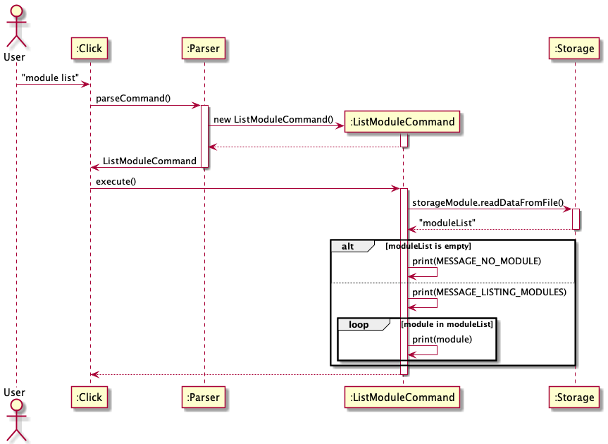

# Module-related Features

## Adding a Module

This feature allows user to add a new Module. 

If the creation is successful, a confirmation message on the newly created Module will be displayed to the user.

**Implementation**

The command for listing all modules is implemented by the `AddModuleCommand` class that extends `Command`.

When the user types `module add c/CS2113T n/Software Engineering e/A`, the following sequence of steps will then occur:

## Removing a Module

This feature allows user to remove a Module created in the past.

If the deletion is successful, a confirmation message on the Module deletion will be displayed to the user.

**Implementation**

The command for listing all modules is implemented by the `DeleteModuleCommand` class that extends `Command`.

When the user types `module delete 2`, the following sequence of steps will then occur:

## Listing All Modules

This feature allows user to view all Modules.

**Implementation**

The command for listing all modules is implemented by the `ListModuleCommand` class that extends `Command`.

When the user types `module list`, the following sequence of steps will then occur:

1. User executes `module list`\
i. `Click` receives user's input.\
ii. `Parser` calls `parser.parseCommand(userInput)` to parse user's input into a `Command`.
2. Creating `ListModuleCommand` object.
3. Executing command.\
i. `ListModuleCommand` calls `storage.StorageModule.readDataFromFile()` to read Module-related data from the storage file.\
ii. `ListModuleCommand` check if there is any Modules in the list. If not, prints the message of having no Modules then return.\
iii. `ListModuleCommand` prompts the message to list the Modules to the user and prints out the Modules line by line.

The sequence diagram below summarizes how listing modules work:

## Calculating Expected CAP